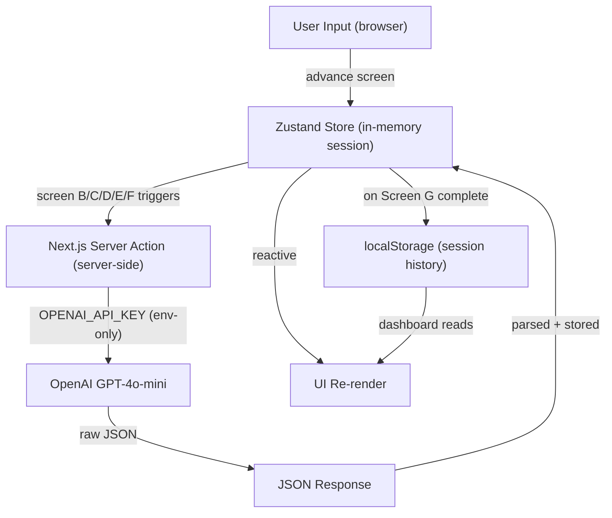

# The Socratic Anchor

> An anti-slop workspace that uses AI to increase meaningful friction — not automate output.

---

## What Inspired This

Every creative tool we use promises to make things easier. AI writes the first draft. AI suggests the next step. AI fills the blank page.

And somehow, the blank page anxiety got worse.

The insight behind this project came from a simple observation: the people who feel most stuck creatively are not stuck because they lack ideas. They are stuck because they have too many — and no way to know which one is actually theirs. Every AI tool they open makes it worse by generating more output they didn't earn.

We asked a different question: **what if AI refused to do the work for you?**

The Socratic Anchor is built on the premise that the most powerful thing AI can do for a stuck creative is create the conditions for them to think clearly — not think for them. The product takes its name from the Socratic method: a form of inquiry that uses questions, not answers, to surface what someone already knows but hasn't yet faced.

---

## What We Built

A 7-screen linear session that takes a burnt-out creative from "overwhelmed with everything" to "I know exactly what to do next" — in 30 minutes. With zero AI-generated content.

### The 7-Screen Flow

| Screen | Name             | What happens                                                                                                               |
| ------ | ---------------- | -------------------------------------------------------------------------------------------------------------------------- |
| A      | Arrival          | User names their repeating pattern — not their goals, their _behavior_                                                     |
| B      | Story Dump       | 3 prompts → AI reads it like a behavioral analyst, finds the loop and the hidden belief running it                         |
| C      | Identity Beliefs | AI surfaces 2-3 "I am someone who \_\_\_" statements using the user's exact words as evidence                              |
| D      | The Anchor       | 5 sequential questions — no skip. Q1-3 fixed, Q4-5 AI-generated from the user's specific answers                           |
| E      | Project Triage   | Every project gets a verdict: Pursue, Park, or Kill — with the AI naming what each Kill project was helping the user avoid |
| F      | Commitment       | An implementation intention: "I will [action] at [time] in [place]" — physical, specific, undelegatable                    |
| G      | Exit             | Read-only summary of everything the user decided. Export to clipboard.                                                     |

### What the AI is Forbidden From Doing

The AI (GPT-4o-mini via Next.js Server Actions) operates under a strict behavioral contract:

- **FORBIDDEN**: generating creative content, prose, ideas, or suggestions
- **REQUIRED**: all output is raw JSON — no markdown wrappers, no prose outside the object
- Every diagnosis must reference something the user actually wrote

The AI reads behavior, not taste. It identifies loops, not themes.

---

## How We Built It

**Stack:** Next.js 15 (App Router), Tailwind CSS, shadcn/ui, Framer Motion, Zustand, OpenAI GPT-4o-mini

**Architecture:** All AI calls run as Next.js Server Actions — the API key never touches the client. Each screen's action receives only the data it needs, nothing more. The session state lives in a Zustand store (in-memory), keeping the architecture simple and the demo reliable.

**AI Prompting Strategy:** Each of the 5 AI functions uses a different behavioral science framework:

- **Screen B** uses _behavior loop detection_ — finds the repeated pattern, not the surface complaint
- **Screen C** uses _identity-based motivation_ — "I am someone who **_" drives behavior more durably than "I want to _**"
- **Screen D Q4/Q5** uses the _5 Whys_ escalation — each question targets what the previous answer was avoiding
- **Screen E** uses _regret minimization_ — which project, if not done, will they regret in 5 years?
- **Screen F** uses _implementation intentions_ — research by Gollwitzer (1999) shows that specifying when, where, and how increases follow-through by $2\times$–$3\times$ vs vague goals

Formally, if $p$ is the probability of follow-through on a vague commitment and $p'$ is the probability with a full implementation intention:

$$p' \approx 2p \text{ to } 3p$$

This is why Screen F doesn't ask "what will you do?" — it asks for a specific contract.

**Design:** Apple-Zen principles — pure white, heavy whitespace, `backdrop-blur` cards, `AnimatePresence` screen transitions, grainy noise CSS overlay for texture, `navigator.vibrate(10)` on all primary buttons.

---

## Technical Architecture

### Data Flow



### File Structure

```
src/
├── app/
│   ├── page.tsx              # Landing page (/)
│   ├── layout.tsx            # Root layout, font, metadata
│   ├── globals.css           # Design tokens, grain overlay, animations
│   ├── actions.ts            # All 5 Server Actions — AI calls live here
│   ├── session/
│   │   └── page.tsx          # 7-screen flow (/session)
│   └── dashboard/
│       ├── page.tsx          # Pattern history (/dashboard)
│       └── DashboardClient.tsx
├── components/
│   ├── SocraticFlow.tsx      # AnimatePresence screen router
│   ├── ProgressBar.tsx       # Fixed 7-step top bar
│   ├── PrimaryButton.tsx     # Blue button + navigator.vibrate(10)
│   └── screens/
│       └── ScreenA.tsx → ScreenG.tsx
└── lib/
    ├── store.ts              # Zustand — full session state shape
    ├── openai.ts             # OpenAI singleton + system prompt
    └── history.ts            # localStorage read/write for dashboard
```

### Layer Breakdown

| Layer | Technology | Role |
|-------|-----------|------|
| Routing | Next.js 15 App Router | `/`, `/session`, `/dashboard` |
| Session state | Zustand | In-memory, no persistence during session |
| AI calls | Next.js Server Actions | Server-only — API key never sent to client |
| AI model | GPT-4o-mini | JSON mode enforced on every call |
| Persistence | localStorage | Session history saved on Screen G completion |
| Animations | Framer Motion | Spring transitions between screens, card reveals |
| Styling | Tailwind CSS v4 + shadcn/ui | Design tokens + base components |

### Key Architectural Decision: Server Actions

All AI calls are Next.js Server Actions (`"use server"`). This means:

- `OPENAI_API_KEY` lives only in `.env.local` on the server — never bundled into client JS
- Each action receives only the minimum data it needs for that screen — no full session blob sent over the wire
- JSON mode is enforced on every OpenAI call — the frontend can always `JSON.parse()` the response safely

```
Client component calls action → Next.js routes to server → OpenAI called → JSON returned → Zustand updated → UI re-renders
```

The entire round-trip takes 2-4 seconds. No streaming, no websockets, no queue — GPT-4o-mini is fast enough at this payload size.

---

## Challenges We Faced

**1. The hardest design decision was what NOT to build.**

Every instinct said to add a generate button, a suggestion feature, an "AI helper" for when users get stuck. Every one of those would have destroyed the product. The constraint is the product.

**2. Prompting an AI to refuse to help.**

Getting GPT-4o-mini to consistently produce behavioral diagnoses without sliding into encouragement, suggestions, or generic observations required significant prompt iteration. The system prompt defines a persona — a "behavioral pattern analyst" — with explicit laws and a specific psychological toolkit.

**3. The linear flow with no back button.**

The decision to remove backtracking was intentional — momentum is a feature, not a bug. But it created an edge case: if the AI call on Screen B failed, users were stranded on Screen C with no themes and no way to retry. We added a "Go back to Story Dump" escape hatch for that specific failure state.

**4. What "creative flourishing" actually means.**

The easy answer is: give people more tools to create more things faster. We rejected that. Flourishing for a creative isn't more output — it's more ownership. The session ends not with a draft the user can't defend but with a decision the user actually made. That distinction drove every tradeoff in the product.

---

## What We Learned

- Friction, designed correctly, is generative. The 50-character minimum on Screen A isn't a gate — it's the first act of commitment.
- Identity statements ("I am someone who **_") are more motivating than goal statements ("I want to _**") because they make behavior feel like self-expression rather than self-improvement.
- The most valuable thing you can build for a stuck person is not a shortcut. It's a mirror that makes avoidance visible.

---

## Getting Started

```bash
# Install dependencies
npm install

# Add your API key
cp .env.local.example .env.local
# Edit .env.local and add your OPENAI_API_KEY

# Run the dev server
npm run dev
```

Open [http://localhost:3000](http://localhost:3000).

---

## Environment Variables

| Variable         | Required | Description                         |
| ---------------- | -------- | ----------------------------------- |
| `OPENAI_API_KEY` | Yes      | GPT-4o-mini — powers all 5 AI gates |
